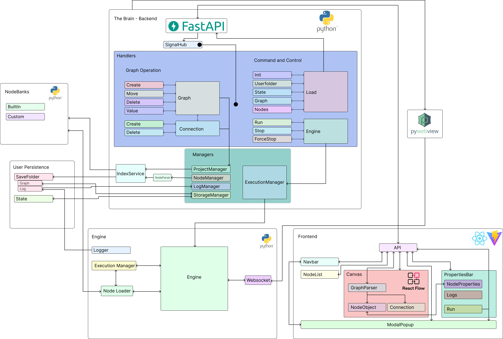

# Loom

Loom is a visual, node-based programming system built on top of Python.

Instead of writing code line-by-line, users construct logic by connecting nodes, making program flow easier to understand, modify, and extend.

<a href="https://youtu.be/XIzYka-iZ1Y">Loom Demo</a>
<a href="https://youtu.be/SGlaM22GnvE">Loom Viva</a>
<a href="https://v3.pebblepad.co.uk/spa/#/public/mtw79Z8zwmw669768mZgs6nz4M">E-Portfolio</a>
[Report (PDF)](./docs/loom-report.pdf)

## Objective

Loom aims to bridge the gap between beginner-friendly visual programming and real-world coding by:

- To shift focus from code syntax to overall data flow and system structure 
- To provide a visual graph-based interface for representing program execution 
- To encourage modular design using independent and reusable nodes 

## System Architecture

The system is built around three core layers:

- **Interface Layer** — Handles node creation, graph editing, and user interaction  
- **Execution Layer** — Processes node relationships and determines execution order  
- **Python Engine** — Executes the generated logic using Python and external libraries  

## What you can do

- Build logic using a node-based graph  
- Execute workflows with clear, layered order  
- Combine nodes into complex pipelines  
- Extend functionality through Python libraries  

## Simplified Guide

1. Create nodes representing logic blocks  
2. Connect nodes to define data flow  
3. Organize nodes into layers (execution order)  
4. Run the graph to execute the workflow  

## Features

- Node-based workflow system  
- Layered execution model  
- Python-powered backend  
- Modular and extensible design  