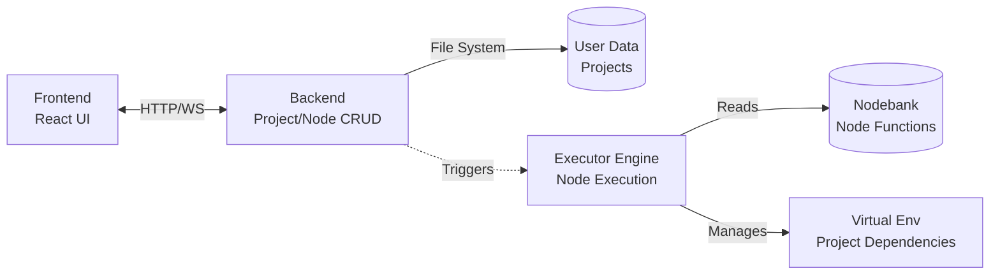
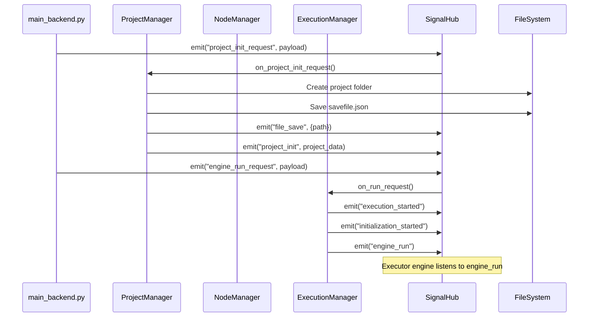
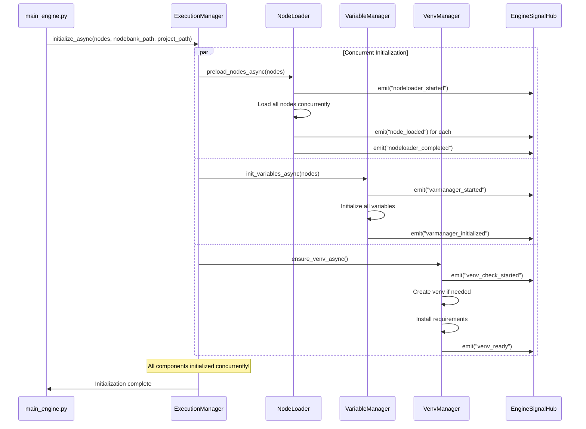
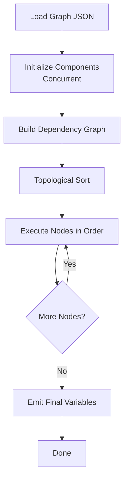
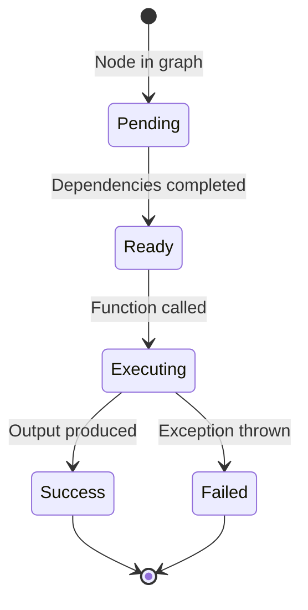

# Loom Architecture Documentation

> **Last Updated**: 2026-01-07

## System Overview

Loom is a visual node-based programming system consisting of three main components:



### Component Responsibilities

| Component | Purpose | Technology |
|-----------|---------|------------|
| **Frontend** | Visual node editor, UI for creating/managing projects | React + Vite |
| **Backend** | CRUD operations for projects and nodes, coordination | Python + SignalHub |
| **Executor** | Node execution engine, dependency resolution, execution | Python + EngineSignalHub |

---

## Backend Architecture

### Module Structure

```
backend/src/
├── main_backend.py          # CLI entry point, command dispatcher
└── modules/
    ├── signal_hub.py         # Backend signal coordination (async)
    ├── execution_manager.py  # Execution coordinator (backend → executor)
    ├── project_manager.py    # Project CRUD operations
    ├── node_manager.py       # Custom node CRUD operations
    └── validator.py          # Payload validation
```

### Backend Signal Flow



### Key Design Patterns

**Signal-Based Decoupling**
- All modules communicate via `SignalHub`
- No direct function calls between managers
- Easy to add new listeners without modifying existing code

**Request/Response Pattern**
- CLI emits `*_request` signals
- Managers handle requests via `_handle_*` methods
- Managers emit result/status signals

**Validation Layer**
- All inputs validated before processing
- Validation errors emitted as signals
- Prevents invalid data from reaching managers

---

## Executor Architecture

### Module Structure

```
executor/engine/
├── main_engine.py          # Entry point, async orchestration
├── engine_signal.py        # Engine signal hub (async)
├── execution_manager.py    # Sequencer & execution logic
├── node_loader.py          # Dynamic node loading (async)
├── variable_manager.py     # Variable/data flow management (async)
└── venv_manager.py         # Virtual environment management (async)
```

### Async Initialization Flow

One of the key optimizations is concurrent initialization of components:



### Execution Pipeline

After initialization, nodes are executed in topological order:



### Node Lifecycle



---

## Integration Points

### Backend ↔ Executor

**Current Integration**: File-based
- Backend creates/updates `savefile.json`
- Executor reads `savefile.json` for execution
- Communication via signals (if shared SignalHub)

**Future Integration**:  Signal bridge or shared hub could enable real-time communication

### Frontend ↔ Backend

**HTTP REST API** (planned)
- `POST /projects` - Create project
- `GET /projects` - List projects
- `PUT /projects/:id` - Update project
- `DELETE /projects/:id` - Delete project
- `POST /execute` - Trigger execution

**WebSocket** (planned)
- Real-time execution progress updates
- Live variable value updates
- Node execution status

---

## Signal Architecture

Both backend and executor use signal hubs for internal coordination:

| Hub | Location | Purpose |
|-----|----------|---------|
| **SignalHub** | `backend/src/modules/signal_hub.py` | Backend coordination |
| **EngineSignalHub** | `executor/engine/engine_signal.py` | Executor coordination |

### Why Separate Hubs?

- **Separation of Concerns**: Backend and executor have different responsibilities
- **Independent Scalability**: Can run in separate processes/containers
- **Clear Boundaries**: Explicit integration points prevent tight coupling

See [SIGNALS.md](./SIGNALS.md) for complete signal reference.

---

## Data Flow

### Project Creation Flow

```
User Input → Backend CLI → ProjectManager
→ Create folder structure
→ Initialize savefile.json
→ Emit signals
→ Return success
```

### Execution Flow

```
savefile.json → Executor  main_engine.py
→ Initialize (NodeLoader, VenvManager, VariableManager) CONCURRENTLY
→ Build dependency graph
→ Topological sort
→ Execute nodes sequentially
→ Update variables
→ Emit results
```

---

## File System Structure

```
Loom/
├── backend/              # Backend CRUD operations
│   └── src/
│       ├── main_backend.py
│       └── modules/
├── executor/             # Execution engine
│   └── engine/
│       ├── main_engine.py
│       └── *.py
├── nodebank/             # Node function library
│   ├── builtin/          # Built-in nodes
│   └── custom/           # User-defined nodes
├── userdata/             # User projects
│   └── ProjectName/
│       ├── savefile.json # Project graph data
│       ├── venv/         # Project-specific venv
│       └── requirements.txt
└── frontend/             # React UI (separate)
```

---

## Performance Optimizations

### Async Initialization (NEW)

**Before**: Sequential initialization (~3-5 seconds)
```
NodeLoader: 2s → VenvManager: 2s → VariableManager: 0.5s = 4.5s total
```

**After**: Concurrent initialization (~2-3 seconds)
```
NodeLoader ─┐
VenvManager ─┼─→ All run concurrently = ~2s total (limited by slowest)
VarManager ─┘
```

**Speedup**: ~50% reduction in initialization time

### Module Caching

- NodeLoader caches loaded Python modules
- Subsequent executions load faster
- Cache invalidation on node updates

---

## Testing Strategy

See [docs/TESTING.md](./TESTING.md) for complete testing documentation.

**Test Organization**:
- `backend/tests/` - Backend unit tests
- `executor/tests/` - Executor unit tests
- `tests/` - Integration tests

**Test Types**:
- Unit tests for individual modules
- Integration tests for signal flow
- Performance tests for async optimization

---

## Future Enhancements

1. **Parallel Node Execution**: Execute independent nodes concurrently
2. **Distributed Execution**: Run nodes on different machines
3. **Execution Caching**: Cache node outputs for faster re-runs
4. **Live Debugging**: Step through execution, inspect variables
5. **Hot Reload**: Update nodes without restarting execution
