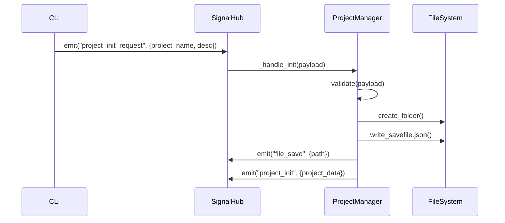
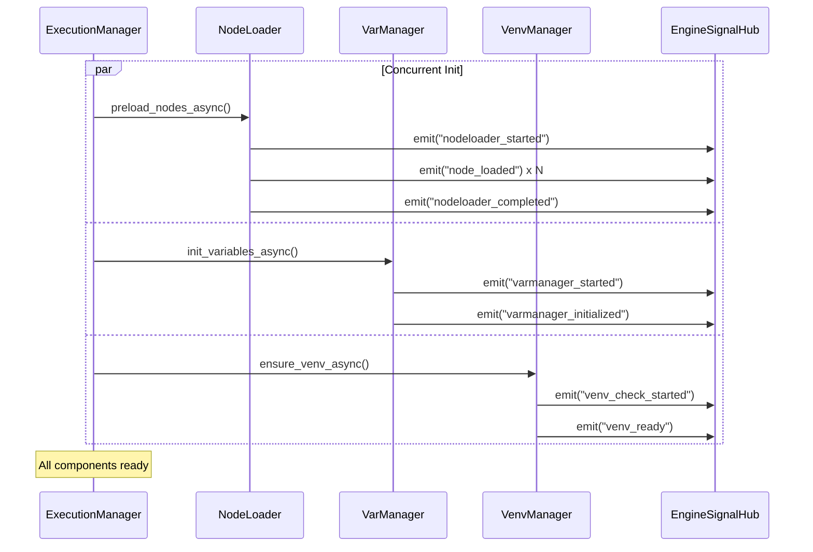

# Loom Signal Documentation

> **Last Updated**: 2026-01-07

Complete reference for the Loom signal architecture, covering both backend `SignalHub` and executor `EngineSignalHub`.

---

## Table of Contents

1. [Signal Architecture Overview](#signal-architecture-overview)
2. [Backend Signals](#backend-signals)
3. [Executor Engine Signals](#executor-engine-signals)
4. [Async Signal Patterns](#async-signal-patterns)
5. [Best Practices](#best-practices)
6. [Testing Signals](#testing-signals)

---

## Signal Architecture Overview

Loom uses **two separate signal hubs** for decoupled communication:

| Hub | Location | Scope |
|-----|----------|-------|
| **SignalHub** | `backend/src/modules/signal_hub.py` | Backend project/node CRUD coordination |
| **EngineSignalHub** | `executor/engine/engine_signal.py` | Executor engine internal coordination |

### Why Two Hubs?

- **Separation of Concerns**: Backend manages data, executor executes
- **Independent Deployment**: Can run in separate processes
- **Clear Boundaries**: Explicit integration points

### Signal Naming Conventions

```
<component>_<action>_<status>

Examples:
- nodeloader_started      # Component: nodeloader, Action: N/A, Status: started
- node_loaded             # Component: node, Action: loaded
- venv_install_progress   # Component: venv, Action: install, Status: progress
- execution_finished      # Component: execution, Action: N/A, Status: finished
```

---

## Backend Signals

### Signal Hub Features

```python
from backend.src.modules.signal_hub import SignalHub

hub = SignalHub(enable_logging=True)  # Enable signal logging

# Sync handler
hub.on("signal_name", lambda payload: print(payload))
hub.emit("signal_name", {"data": "value"})

# Async handler
async def async_handler(payload):
    await some_async_operation(payload)

hub.on_async("signal_name", async_handler)
await hub.emit_async("signal_name", {"data": "value"})

# Fire and forget
hub.emit_concurrent("signal_name", {"data": "value"})

# Handler management
hub.off("signal_name", handler)  # Remove handler
hub.clear("signal_name")         # Remove all handlers
```

### Project Signals

| Signal | Payload | Description |
|--------|---------|-------------|
| `project_init_request` | `{projectName, description, author}` | Request to create project |
| `project_init` | `{projectId, projectName, projectPath, metadata, nodes, connections}` | Project created successfully |
| `project_update_request` | `{project_name, entity_type, entity_id, updates, project_updates}` | Request to update project |
| `project_update` | `{project_name, ...}` | Project updated successfully |
| `project_delete_request` | `{projectName}` | Request to delete project |
| `project_delete` | `{projectName}` | Project deleted |
| `project_index_request` | `null` | Request to rebuild project index |
| `project_index_updated` | `{count, projects[]}` | Project index rebuilt |

### Node Signals

| Signal | Payload | Description |
|--------|---------|-------------|
| `node_add_request` | `{nodeId, name, ref, metadata}` | Request to add custom node |
| `node_add` | `{nodeId, name}` | Node added successfully |
| `node_update_request` | `{nodeId, updates}` | Request to update node |
| `node_update` | `{nodeId}` | Node updated |
| `node_delete_request` | `{nodeId}` | Request to delete node |
| `node_delete` | `{nodeId}` | Node deleted |
| `node_index_updated` | `{count}` | Node index rebuilt |

### Execution Coordination Signals (Backend → Executor)

| Signal | Payload | Description |
|--------|---------|-------------|
| `engine_run_request` | `{run_id?, project_path?, ...}` | Request engine to start |
| `engine_stop_request` | `null` | Request engine to stop |
| `initialization_started` | `{run_id, phase}` | Engine initialization begins |
| `initialization_progress` | `{message, phase}` | Progress during init |
| `initialization_completed` | `{phase}` | Engine init complete |
| `execution_started` | `{run_id}` | Execution started |
| `execution_progress` | `{current, total, percent}` | Execution progress |
| `execution_finished` | `{status}` | Execution completed |
| `execution_error` | `{error}` | Execution failed |
| `execution_rejected` | `{reason}` | Request rejected (e.g., already running) |

### File & Validation Signals

| Signal | Payload | Description |
|--------|---------|-------------|
| `file_save` | `{path}` | Before saving file |
| `file_loaded` | `{path}` | After loading file |
| `file_error` | `{path, error}` | File operation failed |
| `validation_error` | `{message}` | Payload validation failed |

### UI Feedback Signals

| Signal | Payload | Description |
|--------|---------|-------------|
| `toast_message` | `{message, type}` | Display notification |
| `highlight_node` | `{nodeId}` | Highlight node in UI |

---

## Executor Engine Signals

### Signal Hub Features

Same API as backend SignalHub:

```python
from executor.engine.engine_signal import EngineSignalHub

hub = EngineSignalHub(enable_logging=True)
hub.on("signal_name", handler)
hub.on_async("signal_name", async_handler)
await hub.emit_async("signal_name", payload)
```

### NodeLoader Signals

| Signal | Payload | Description |
|--------|---------|-------------|
| `nodeloader_started` | `{count}` | Node loading begins |
| `node_loading` | `{nodeId, name, progress}` | Loading specific node |
| `node_loaded` | `{nodeId, name}` | Node loaded successfully |
| `node_load_failed` | `{nodeId, name, error}` | Node load failed |
| `nodeloader_completed` | `{loaded_count, failed_count, total}` | All nodes processed |

### VariableManager Signals

| Signal | Payload | Description |
|--------|---------|-------------|
| `varmanager_started` | `{node_count}` | Variable init begins |
| `varmanager_initialized` | `{variable_count, node_count}` | Init complete |
| `variable_set` | `{var_name, old_value, new_value, node_id}` | Variable changed (verbose) |

### VenvManager Signals

| Signal | Payload | Description |
|--------|---------|-------------|
| `venv_check_started` | `{path}` | Checking venv status |
| `venv_creation_started` | `{path}` | Creating new venv |
| `venv_creation_completed` | `{path}` | Venv created |
| `venv_install_started` | `{requirements_file}` | Installing dependencies |
| `venv_install_progress` | `{line}` | Pip output line |
| `venv_install_completed` | `{requirements_file}` | Install complete |
| `venv_ready` | `{path}` | Venv ready for use |
| `venv_error` | `{error, stage}` | Venv operation failed |

### Execution Signals

| Signal | Payload | Description |
|--------|---------|-------------|
| `engine_run` | `{status}` | Engine starting execution |
| `engine_node_started` | `{nodeId}` | Node execution started |
| `engine_node_finished` | `{nodeId, output}` | Node execution finished |
| `engine_progress` | `{phase, current?, total?, percent?, message?}` | Progress updates |
| `engine_stop` | `{status}` | Engine stopping |
| `engine_error` | `{error, phase?}` | Engine error occurred |

### Error Handling Signals

| Signal | Payload | Description |
|--------|---------|-------------|
| `handler_error` | `{signal, handler, error, async?}` | Signal handler threw exception |

---

## Async Signal Patterns

### Pattern 1: Await All Handlers

**Use When**: Need to ensure all handlers complete before proceeding

```python
# Registration
hub.on_async("data_saved", async_backup_handler)
hub.on_async("data_saved", async_notify_handler)

# Emission (waits for both)
await hub.emit_async("data_saved", {"id": 123})
print("All handlers completed")
```

### Pattern 2: Fire and Forget

**Use When**: Don't want to block on handler execution

```python
# Emission (returns immediately)  
hub.emit_concurrent("background_task", {"id": 123})
print("Signal fired, handlers running in background")
```

### Pattern 3: Mixed Sync/Async

**Use When**: Some handlers are sync, some async

```python
hub.on("event", sync_handler)           # Sync
hub.on_async("event", async_handler)    # Async

# Both are called:
await hub.emit_async("event", payload)  # Sync first, then async
```

### Pattern 4: Error Isolation

**Use When**: Handler failures shouldn't stop other handlers

```python
async def failing_handler(payload):
    raise Exception("Oops!")

hub.on_async("event", failing_handler)
hub.on_async("event", working_handler)

# working_handler still executes even if failing_handler crashes
await hub.emit_async("event", payload)
```

---

## Best Practices

### 1. Signal Naming

✅ **Good**:
```python
hub.emit("nodeloader_started", {"count": 10})
hub.emit("node_loaded", {"nodeId": "n1"})
```

❌ **Bad**:
```python
hub.emit("start_loading", {"count": 10})  # Unclear component
hub.emit("loaded", {"nodeId": "n1"})       # Too generic
```

### 2. Payload Structure

✅ **Good**:
```python
hub.emit("execution_error", {
    "error": str(exception),
    "nodeId": node_id,
    "phase": "execution"
})
```

❌ **Bad**:
```python
hub.emit("execution_error", exception)  # Not serializable
hub.emit("execution_error", "Error!")   # No context
```

### 3. Handler Registration

✅ **Good**:
```python
def __init__(self, signal_hub):
    self.signal_hub = signal_hub
    signal_hub.on("request", self._handle_request)  # Instance method
```

❌ **Bad**:
```python
signal_hub.on("request", lambda p: print(p))  # Hard to debug/remove
```

### 4. Error Handling in Handlers

✅ **Good**:
```python
async def safe_handler(payload):
    try:
        await risky_operation(payload)
    except Exception as e:
        logger.error(f"Handler failed: {e}")
        # Signal hub will emit handler_error signal
```

❌ **Bad**:
```python
async def unsafe_handler(payload):
    await risky_operation(payload)  # Crashes if fails
```

### 5. Avoid Infinite Loops

✅ **Good**:
```python
def on_error(payload):
    if payload.get("signal") != "handler_error":
        log_error(payload)
```

❌ **Bad**:
```python
def on_error(payload):
    signal_hub.emit("error", payload)  # Could trigger itself!
```

---

## Testing Signals

### Unit Testing Signals

```python
import pytest
from backend.src.modules.signal_hub import SignalHub

def test_signal_emission():
    hub = SignalHub()
    received = []
    
    hub.on("test_signal", lambda p: received.append(p))
    hub.emit("test_signal", {"data": "test"})
    
    assert len(received) == 1
    assert received[0]["data"] == "test"

@pytest.mark.asyncio
async def test_async_signal():
    hub = SignalHub()
    result = []
    
    async def async_handler(payload):
        await asyncio.sleep(0.01)
        result.append(payload)
    
    hub.on_async("test", async_handler)
    await hub.emit_async("test", {"value": 42})
    
    assert len(result) == 1
    assert result[0]["value"] == 42
```

### Integration Testing Signal Flow

```python
def test_project_creation_signals():
    hub = SignalHub()
    signals_received = []
    
    # Track all signals
    for signal in ["project_init_request", "file_save", "project_init"]:
        hub.on(signal, lambda p, s=signal: signals_received.append(s))
    
    # Create project manager
    pm = ProjectManager(base_path="test_data", signal_hub=hub)
    
    # Trigger project creation
    hub.emit("project_init_request", {"projectName": "TestProject"})
    
    # Verify signal sequence
    assert "project_init_request" in signals_received
    assert "file_save" in signals_received
    assert "project_init" in signals_received
```

### Mocking Signals

```python
from unittest.mock import Mock

def test_with_mock_hub():
    mock_hub = Mock(spec=SignalHub)
    component = SomeComponent(signal_hub=mock_hub)
    
    component.do_something()
    
    # Verify signal was emitted
    mock_hub.emit.assert_called_with("some_signal", {"data": "value"})
```

---

## Signal Flow Examples

### Example 1: Project Initialization



### Example 2: Async Engine Initialization



---

## Advanced Topics

### Custom Signal Hub

If you need a specialized signal hub:

```python
from backend.src.modules.signal_hub import SignalHub

class CustomHub(SignalHub):
    def emit(self, signal_name, payload=None):
        # Add custom logic (e.g., persistence)
        self._log_to_file(signal_name, payload)
        super().emit(signal_name, payload)
```

### Signal Middleware

Intercept all signals:

```python
original_emit = hub.emit

def emit_with_logging(signal_name, payload):
    print(f"[SIGNAL] {signal_name}: {payload}")
    original_emit(signal_name, payload)

hub.emit = emit_with_logging
```

---

## Troubleshooting

### Signal Not Firing

1. Check handler registration: `hub.registered_signals()`
2. Verify signal name spelling
3. Check if hub is the correct instance
4. Enable logging: `SignalHub(enable_logging=True)`

### Handler Not Called

1. Ensure handler registered before signal emitted
2. Check for exceptions in handler (check logs)
3. Verify payload structure matches expectations

### Async Handlers Not Awaited

1. Use `emit_async()` not `emit()`
2. Ensure you `await` the `emit_async()` call
3. Check for event loop issues

---

For more information, see:
- [ARCHITECTURE.md](./ARCHITECTURE.md) - System architecture
- [TESTING.md](./TESTING.md) - Testing guide
- [Backend API](./API.md) - Backend API reference
